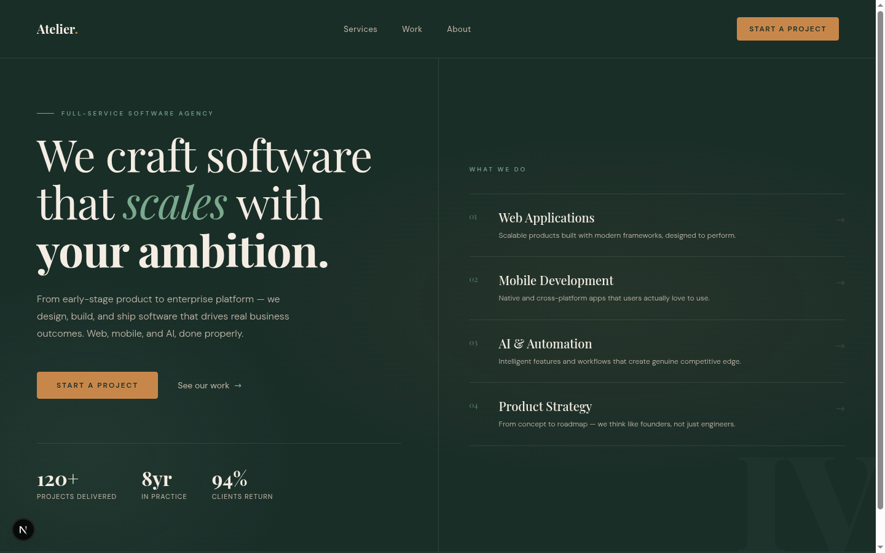
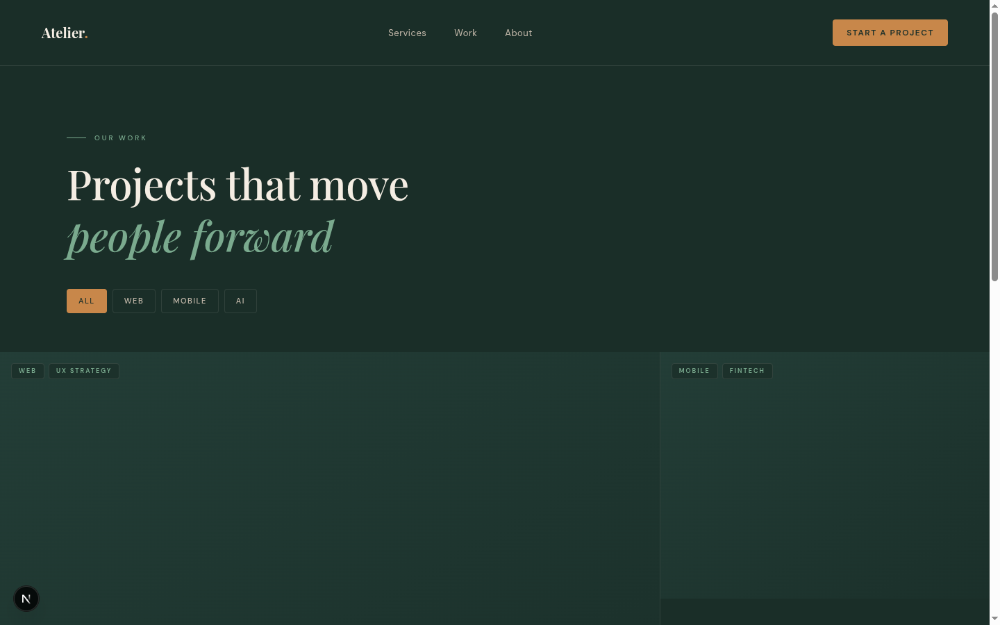
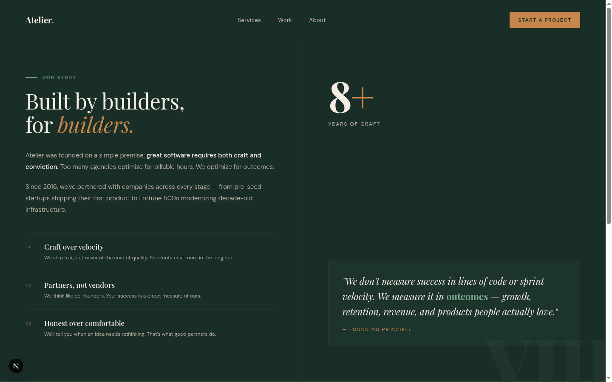
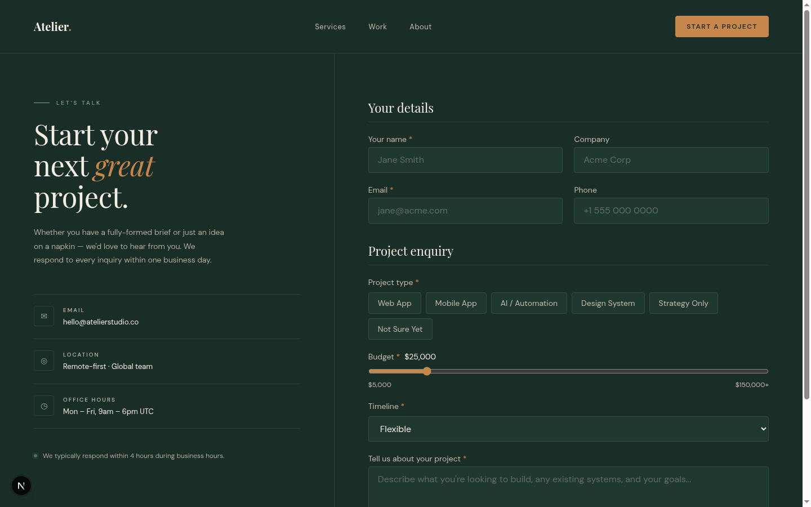

# Atelier Studio — Software Solutions Agency Website

A premium marketing and lead-generation website for a full-service software agency. Built with a "craft-first" editorial aesthetic — Playfair Display serif typography against deep forest green, copper accents, and warm linen tones.

**Live demo:** https://atelier-studio-carlomigueldy.vercel.app

---

## Screenshots

### Hero


### Portfolio


### About


### Contact


---

## Pages

| Route | Description |
|---|---|
| `/` | Hero with split-grid layout, numbered services panel, stats bar, capability ticker |
| `/work` | Portfolio with 12-column asymmetric grid, client-side filter tabs (All / Web / Mobile / AI) |
| `/about` | Agency story, numbered values, manifesto blockquote, 4-column team grid |
| `/contact` | 5fr/7fr split — contact details + full lead form with project type toggles, budget slider, and Zod validation |

---

## Tech Stack

| Layer | Choice |
|---|---|
| Framework | Next.js 16 (App Router) |
| Styling | Tailwind CSS v4 — design tokens via `@theme` |
| Components | shadcn/ui |
| Language | TypeScript |
| Forms | react-hook-form + zod |
| Fonts | Playfair Display + DM Sans via `next/font/google` |
| Tests | Jest + React Testing Library |
| Deployment | Vercel |

---

## Design System

All design tokens live in `app/globals.css` via Tailwind v4's `@theme` directive — no `tailwind.config.ts` needed.

```css
@theme {
  --color-bg:           #1a2e28;   /* deep forest green */
  --color-bg-subtle:    #1f3830;   /* cards, panels */
  --color-bg-hover:     #243f38;   /* hover state */
  --color-linen:        #f4ede3;   /* primary text */
  --color-linen-dim:    #c4b9ab;   /* secondary text */
  --color-copper:       #c8874a;   /* CTAs, emphasis */
  --color-sage:         #7aaa8e;   /* secondary accent */
  --color-border:       rgba(244, 237, 227, 0.1);
  --color-border-focus: rgba(200, 135, 74, 0.5);
  --color-error:        #e07a5f;

  --font-serif: var(--font-playfair), Georgia, serif;
  --font-sans:  var(--font-dm-sans), system-ui, sans-serif;
}
```

Tokens automatically become Tailwind utilities: `bg-bg`, `text-copper`, `border-sage`, `font-serif`, etc.

---

## Project Structure

```
app/
  layout.tsx               root layout — fonts, Nav, metadata
  globals.css              @import tailwindcss + @theme tokens
  page.tsx                 / — Hero
  work/page.tsx            /work — Portfolio grid
  about/page.tsx           /about — Story + Team
  contact/page.tsx         /contact — Info panel + Lead form
  actions/contact.ts       'use server' — submitContact()

components/
  layout/nav.tsx           site navigation
  shared/eyebrow.tsx       reusable eyebrow label
  home/hero.tsx            hero split-grid + stats
  home/ticker.tsx          capability tag bar
  work/case-card.tsx       portfolio card (featured / side / half)
  work/filter-tabs.tsx     All/Web/Mobile/AI filter
  contact/contact-form.tsx lead form with react-hook-form

lib/
  schemas.ts               contactSchema + ContactFormData
  utils.ts                 cn() helper

__tests__/
  lib/schemas.test.ts
  components/contact/contact-form.test.tsx
```

---

## Getting Started

```bash
npm install
npm run dev       # http://localhost:3000
npm test          # 12 tests across 2 suites
npm run build     # production build
```

---

## Key Details

**Tailwind v4 tokens** — `@theme` in `globals.css` defines CSS custom properties that also become Tailwind utility classes. One source of truth, no config file.

**Server vs Client** — Pages are Server Components by default. Only the contact form and portfolio filter opt into `'use client'`. Everything else ships zero client JS.

**Hairline grid** — Portfolio uses `gap-px` on a `bg-border` container. The 1px container background fills the gap, producing hairline separators without explicit borders on each card.

**Italic emphasis pattern** — Key words in Playfair Display headlines use `italic` + `text-copper` or `text-sage` for emphasis without bolding the whole line.

**Form validation** — react-hook-form + zodResolver on the client; the server action re-validates with the same Zod schema before acting (defense in depth).

---

## Contact Form Schema

```typescript
const contactSchema = z.object({
  name:         z.string().min(2, 'Please enter your name'),
  company:      z.string().optional(),
  email:        z.string().email('Please enter a valid email address'),
  phone:        z.string().optional(),
  projectTypes: z.array(z.string()).min(1, 'Please select at least one project type'),
  budget:       z.number().min(5000, 'Minimum budget is $5,000'),
  timeline:     z.string().min(1, 'Please select a timeline'),
  message:      z.string().min(20, 'Please describe your project (at least 20 characters)'),
})
```

---

## License

MIT
